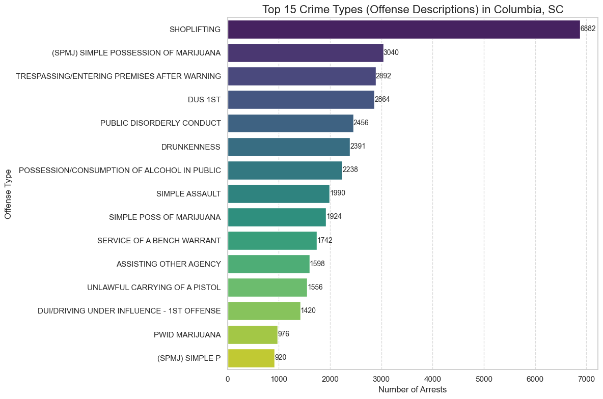
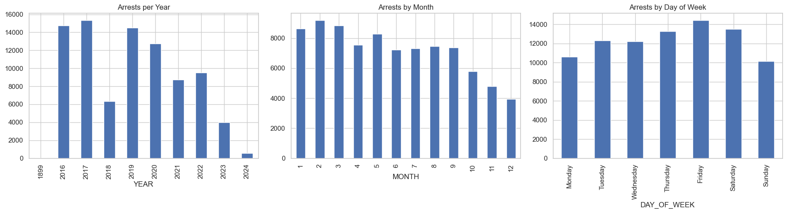
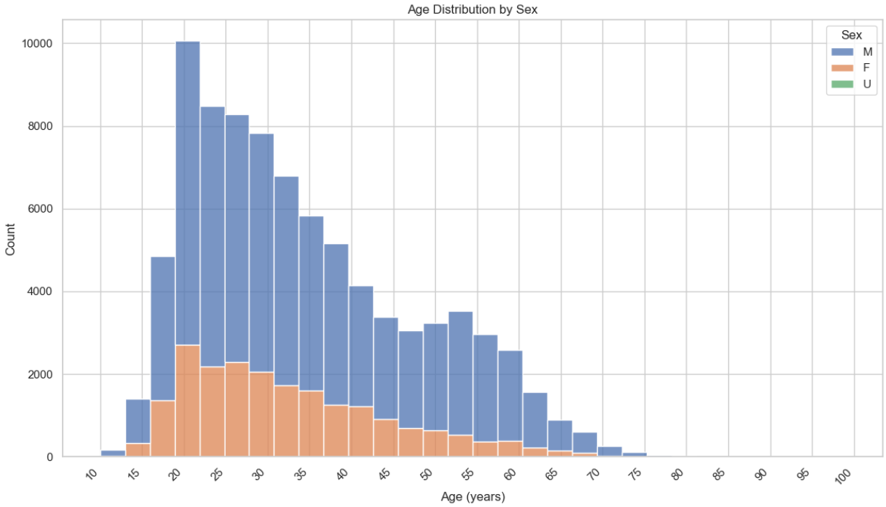
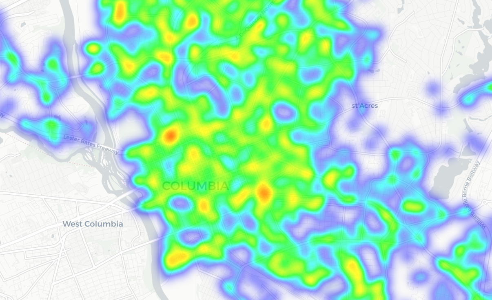

# Columbia, SC Arrest Data Analysis (2016–2024)

A simple, self-contained data project exploring public arrest records from the City of Columbia, South Carolina.

This notebook analyzes trends over time, demographics (age & gender), most common offenses, and basic spatial distribution using Python.


*(Downtown Columbia, SC)*

## Key Visualizations

### Most Common Offense Types


### Arrest Trends Over Time


### Arrests by Gender & Age


### Arrest Locations Heatmap / Overview


## Dataset
- **Source**: City of Columbia Open Data Portal  
  [Arrest Data (1/1/2016 – 12/31/2024)](https://coc-colacitygis.opendata.arcgis.com/datasets/ColaCityGIS::arrest-1-1-2016-to-12-31-2024/about)
- **File**: `arrests_columbia_sc.csv` (included in this repo for reproducibility)

## How to Run Locally
1. Clone the repository:
   ```bash
   git clone https://github.com/altustd/sc-arrests.git
   cd sc-arrests
## How to Run Locally
1. Clone the repo:
   ```bash
   git clone https://github.com/altustd/sc-arrests.git
   cd sc-arrests
